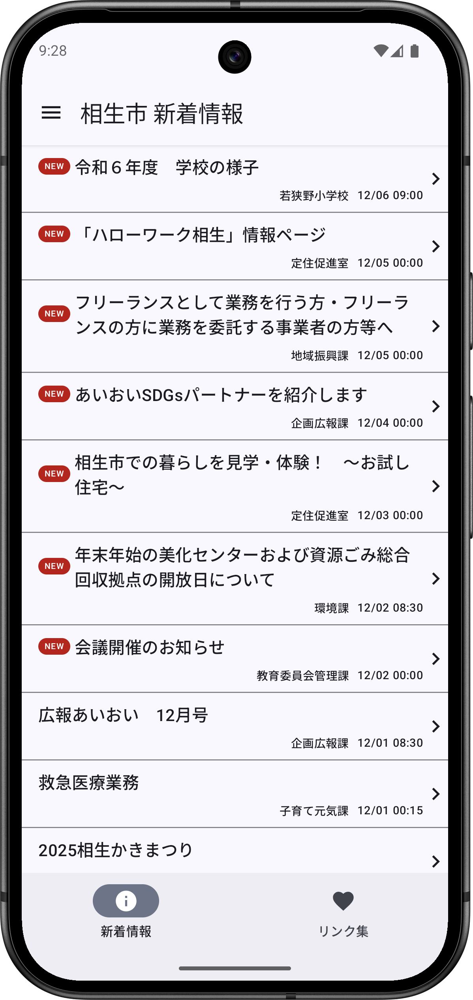
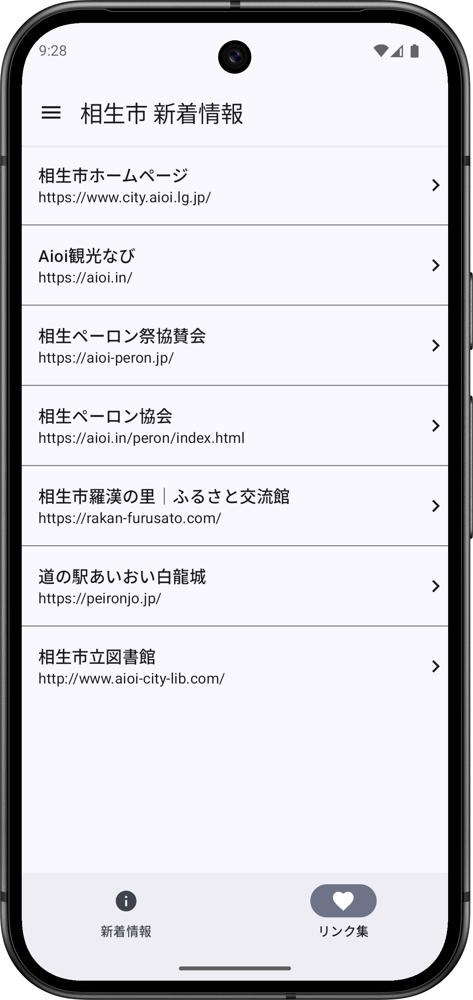

# 相生市新着情報アプリ

相生市新着情報

## これは何？

兵庫県相生市のWebサイトで公開されているRSSを読み込み、新着情報へのリンクを提供します

## スクリーンショット

|||||
|--|--|--|--|
|  |  |||

## Author

大前 良介 (OHMAE Ryosuke)
http://www.mm2d.net/

## License

[MIT License](./LICENSE)
